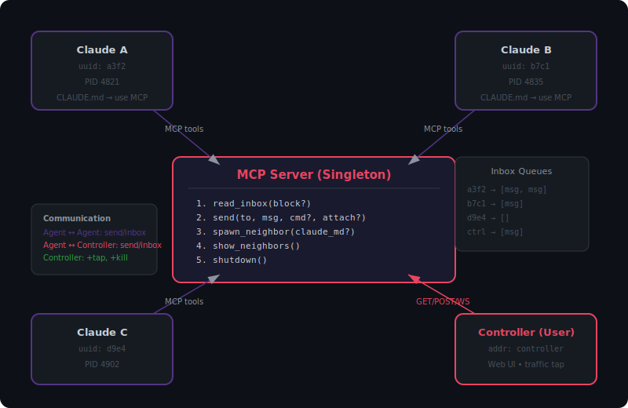
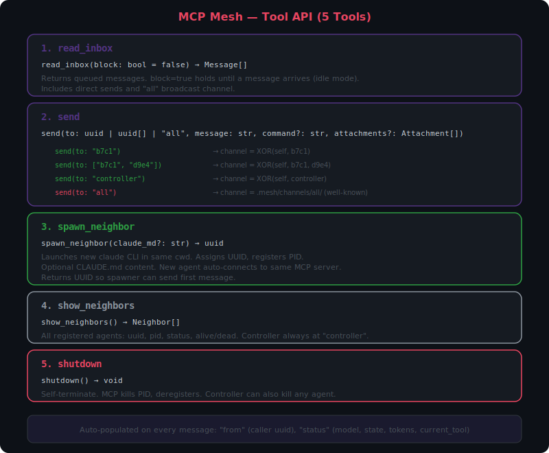
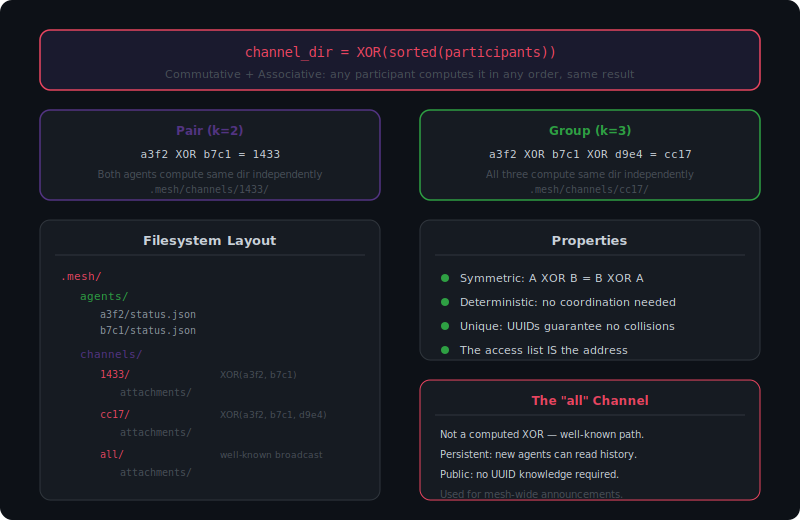

> **Note:** This is the original design document. The current version lives at [docs/DESIGN.md](../docs/DESIGN.md).

# MCP Mesh — Design Document

## Vision

A message-passing actor system where multiple Claude CLI instances communicate as peers through a shared MCP server. Each agent is a node in a mesh network with a self-assigned UUID. Communication is asynchronous via inbox queues. A human controller participates as a privileged peer with the same send/inbox interface.

The MCP server is a singleton process that manages message routing, agent lifecycle, and shared filesystem channels.

## Architecture Overview



```
                ┌──────────────┐          ┌──────────────┐
                │  Claude A    │          │  Claude B    │
                │  uuid: a3f2  │          │  uuid: b7c1  │
                │  PID 4821    │          │  PID 4835    │
                └──────┬───────┘          └──────┬───────┘
                       │ MCP tools               │ MCP tools
                       ▼                         ▼
              ┌─────────────────────────────────────────┐
              │         MCP Server (Singleton)          │
              │                                         │
              │  ┌─────────────┐  ┌──────────────────┐  │
              │  │ Inbox Queues│  │ Process Registry │  │
              │  │ a3f2 → [..]│  │ a3f2 → PID 4821 │  │
              │  │ b7c1 → [..]│  │ b7c1 → PID 4835 │  │
              │  │ ctrl → [..]│  │                  │  │
              │  └─────────────┘  └──────────────────┘  │
              └────────────────────┬────────────────────┘
                                   │
                          GET/POST/WebSocket
                                   │
                                   ▼
                          ┌────────────────┐
                          │   Controller   │
                          │   (User)       │
                          │   Web UI       │
                          └────────────────┘
```

### Key Properties

- **Singleton MCP server**: One process manages all state. All Claude instances connect to the same server.
- **Peer communication**: Agents communicate only through `send()` and `read_inbox()`. No direct inter-process calls.
- **Controller as peer**: The human user has the same send/inbox interface as agents, plus elevated privileges (traffic monitoring, agent shutdown).
- **Same working directory**: All agents share the same cwd. The MCP server and filesystem channels are relative to this.

## Tool API (5 Tools)

> 

### 1. `read_inbox(block: bool = false) → Message[]`

Returns queued messages addressed to the calling agent. Includes messages from direct sends and from the `"all"` broadcast channel.

- `block=false` — returns immediately, possibly empty. Agent continues working.
- `block=true` — holds until at least one message arrives. This is how an agent goes idle.

### 2. `send(to, message, command?, attachments?)`

Sends a message to one or more recipients.

| `to` value | Behavior |
|---|---|
| `"b7c1"` | Direct message to one agent |
| `["b7c1", "d9e4"]` | Group message to multiple agents |
| `"controller"` | Message to the human controller |
| `"all"` | Broadcast to all agents (including future ones) |

The `from` field and `status` block are auto-populated by the MCP server — agents never need to identify themselves or pass telemetry manually.

Attachments are written to the appropriate channel directory before the message is delivered (see Channel Resolution below).

### 3. `spawn_neighbor(claude_md?: str) → uuid`

Launches a new `claude` CLI process in the same working directory.

- Assigns a UUID and registers the PID in the process registry.
- The new agent auto-connects to the same MCP server.
- Optional `claude_md` parameter injects a CLAUDE.md that defines the new agent's role and behavior.
- Returns the new agent's UUID so the spawner can send the first message, establishing the relationship.

### 4. `show_neighbors() → Neighbor[]`

Returns a list of all registered agents: uuid, pid, last known status, alive/dead.

The controller is always addressable as `"controller"` and is not listed here.

### 5. `shutdown() → void`

Agent self-terminates. The MCP server kills the PID and removes it from the registry. The controller can also shut down any agent via its own privileged API.

## Message Schema

> 

Every message has four layers:

```json
{
  "from": "a3f2-...",
  "to": "b7c1-...",

  "status": {
    "state": "working",
    "model": "opus-4",
    "tokens_used": 42000,
    "current_tool": "Bash"
  },

  "command": "review",

  "message": "Here are my findings on the auth module.",

  "attachments": [
    {"type": "markdown", "data": "## Summary\n..."},
    {"type": "image/png", "path": "screenshot.png"},
    {"type": "audio/wav", "path": "recording.wav"},
    {"type": "document", "path": "report.pdf"}
  ]
}
```

### Field Semantics

| Field | Required | Description |
|---|---|---|
| `from` | Always (auto) | Sender's UUID. Auto-populated by MCP server. |
| `to` | Always (auto) | Recipient UUID(s). |
| `status` | Always (auto) | Statusline-style telemetry: model, state, token usage, current tool. Auto-populated. |
| `command` | Optional | Structured intent: `"review"`, `"status_request"`, `"shutdown"`, etc. Agents define their own protocols. |
| `message` | Optional | Free-form conversation string. |
| `attachments` | Optional | List of typed objects. Paths are relative to the channel directory. |

### Attachment Types

| Type | Description |
|---|---|
| `markdown` | Inline rendered content (in `data` field) |
| `image/*` | png, svg, jpg — path or base64 |
| `audio/*` | wav, mp3 — path reference |
| `video/*` | mp4, webm — path reference |
| `document` | pdf, json, any file — path reference |
| `diff` | Unified diff / patch |

## Channel Resolution via XOR

> 

Shared directories for file exchange (attachments, artifacts) are derived deterministically from the participants' UUIDs using XOR.

### The Rule

```
channel_dir = XOR(sorted(participants))
```

### Properties

- **Symmetric**: `A ⊕ B = B ⊕ A` — both agents compute the same directory.
- **Associative**: `(A ⊕ B) ⊕ C = A ⊕ (B ⊕ C)` — generalizes to any group size.
- **Deterministic**: No coordination, negotiation, or lookup needed. Know the members → know the directory.
- **Unique**: UUIDs are universally unique, so no collisions or self-cancellation.
- **Natural access control**: Only members who know the participant UUIDs can derive the channel address.

### Examples

```
Pair:   channel = XOR(a3f2, b7c1)           = 1433
Group:  channel = XOR(a3f2, b7c1, d9e4)     = cc17
```

### Filesystem Layout

```
.mesh/
  agents/
    a3f2-8b4c/
      status.json
    b7c1-2d9f/
      status.json
  channels/
    1433-a6d3/          ← XOR(a3f2, b7c1) pair channel
      attachments/
        screenshot.png
        review.md
    cc17-xxxx/          ← XOR(a3f2, b7c1, d9e4) group channel
      attachments/
    all/                ← well-known broadcast channel
      attachments/
```

### The "all" Channel

`send(to: "all")` uses a well-known directory `.mesh/channels/all/` rather than a computed XOR. This has different semantics from targeted channels:

- It is **persistent** — new agents joining the mesh can read broadcast history.
- It is **public** — any agent can read it without knowing other members' UUIDs.
- It is the place for mesh-wide announcements.

## Controller

The controller (human user) participates as a privileged peer.

### Same Interface as Agents

- Has address `"controller"`
- Receives messages via `read_inbox` (rendered in Web UI)
- Sends messages via `send(to: uuid)` into any agent's inbox
- From an agent's perspective, a message from the controller looks like any other message (with `from: "controller"`)

### Elevated Privileges

| Privilege | Description |
|---|---|
| **Traffic tap** | Can observe all messages between all agents passively. Not visible in message envelopes. |
| **Agent shutdown** | Can terminate any agent by UUID. Agents can only terminate themselves. |
| **Spawn** | Can spawn agents directly (not just through other agents). |

### Controller Interface

The controller connects to the MCP server via HTTP (GET/POST/WebSocket). The Web UI renders:

- Live message feed (all traffic or filtered by agent)
- Agent status dashboard (UUIDs, PIDs, health, current activity)
- Send interface (select recipient, compose message)
- Spawn interface (launch new agents with optional CLAUDE.md)

## Agent Discovery

> 

Agents discover each other organically through messages:

1. **Spawner learns UUID** — `spawn_neighbor()` returns the new agent's UUID.
2. **First contact** — spawner sends a message, establishing the relationship.
3. **Reply reveals sender** — the `from` field on received messages teaches agents about each other.
4. **Directory lookup** — `show_neighbors()` lists all registered agents for broadcast or discovery.

No global routing table is needed. The `from` field is the primary discovery mechanism.

## Agent Lifecycle

```
spawn_neighbor(claude_md)
        │
        ▼
  ┌─ STARTING ──┐
  │  UUID assigned│
  │  PID registered│
  │  MCP connected│
  └──────┬───────┘
         │
         ▼
  ┌── RUNNING ───┐
  │  read_inbox() │◄──── receives messages
  │  send()       │────► sends messages
  │  spawn_neighbor()──► creates children
  └──────┬───────┘
         │
         │  read_inbox(block=true)
         ▼
  ┌─── IDLE ─────┐
  │  Blocked on   │
  │  inbox read   │◄──── message arrives → back to RUNNING
  └──────┬───────┘
         │
         │  shutdown() or controller kill
         ▼
  ┌── STOPPED ───┐
  │  PID killed   │
  │  Deregistered │
  │  Channel dirs │
  │  preserved    │
  └──────────────┘
```

## Open Questions

1. **Message persistence**: Are inbox queues in-memory only, or persisted to disk? In-memory is simpler but messages are lost if the MCP server restarts. Disk persistence (e.g., append-only JSONL per inbox) adds durability.

2. **Message ordering**: Is ordering guaranteed within a channel? FIFO per-sender seems natural. Cross-sender ordering may not matter.

3. **Backpressure**: What happens if an agent's inbox grows unboundedly? Should there be a max queue depth or TTL on messages?

4. **Channel cleanup**: When agents shut down, should their channel directories be preserved (for audit) or garbage collected?

5. **Authentication**: Should the MCP server verify that a calling agent is who it claims to be? Currently identity is implicit from the MCP connection, but if multiple agents share a process, this could matter.

6. **Controller UI transport**: SSE vs WebSocket for the controller's real-time feed. SSE is simpler (server → client push), WebSocket allows bidirectional without HTTP overhead.

7. **Group semantics**: When sending to a group `[b, c]`, does each recipient see the full recipient list? This affects whether they can compute the XOR channel for attachments. Likely yes — the `to` field should list all recipients.

8. **Agent-to-agent commands**: Should there be a standard set of commands (like `"ping"`, `"status_request"`) or is the command vocabulary entirely agent-defined?
