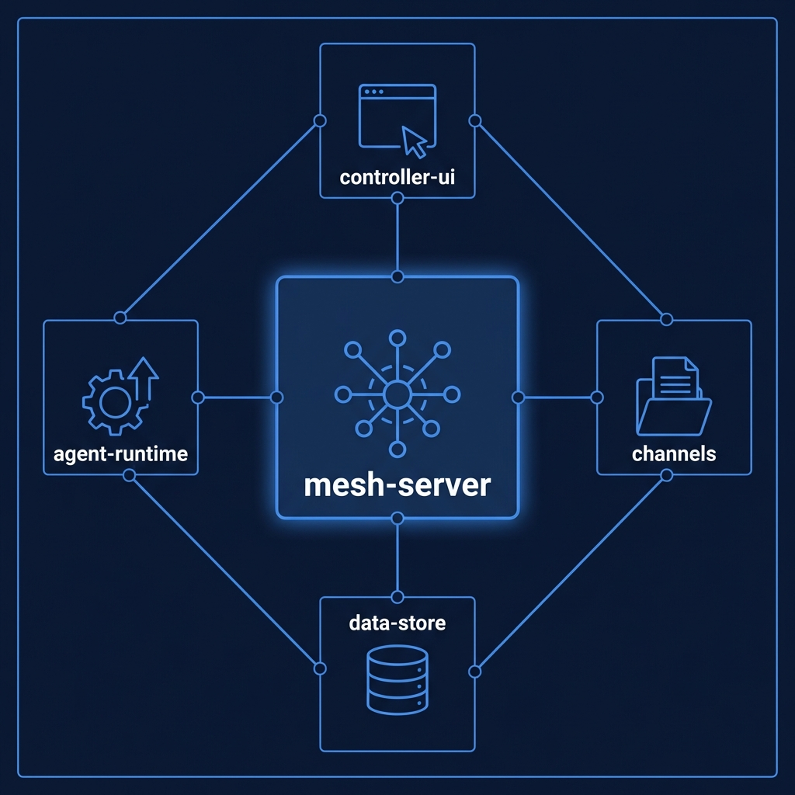
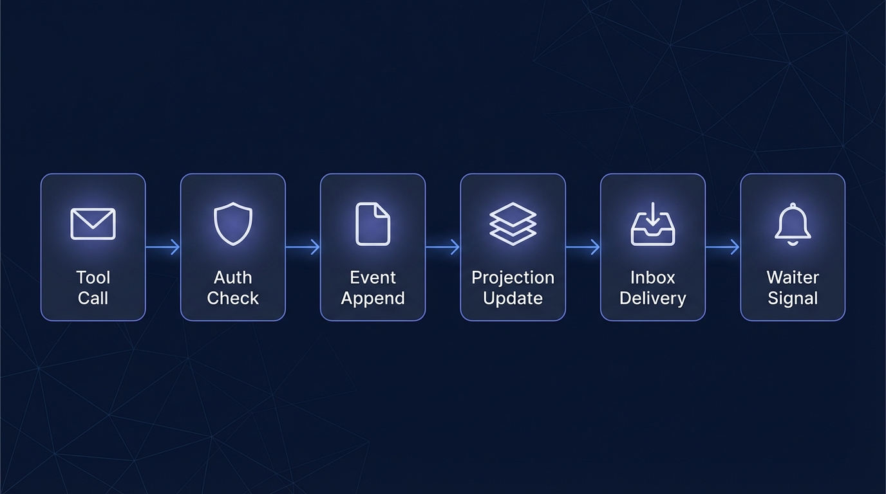

# MCP Mesh — Architecture

## System Overview

MCP Mesh is an event-sourced actor system for orchestrating multiple Claude CLI instances as a collaborative mesh network. Agents communicate as peers through a shared MCP server using inbox queues, with all state changes captured as an immutable event log. A human controller participates as a privileged peer via a web UI, using the same send/inbox interface as agents. The system is designed so that any MCP-capable process — not just Claude — can join the mesh.


For protocol details, see [DESIGN.md](DESIGN.md).

## Subsystem Map



| Subsystem | Purpose | Status | Spec |
|-----------|---------|--------|------|
| [mesh-server](../mesh-server/) | Message routing, agent lifecycle, event store | v0.2 | [SPEC.md](../mesh-server/SPEC.md) |
| [controller-ui](../mesh-server/src/mesh_server/static/) | Web UI for human controller | v0.2 | — |
| [agent-runtime](../agent-runtime/) | Agent bootstrap and lifecycle management | v0.2 | — |
| channels | XOR-derived filesystem channels | Planned | — |

## Technology Stack

| Component | Choice |
|-----------|--------|
| Language | Python 3.13 |
| MCP Framework | FastMCP (`mcp[cli]>=1.2.0`) |
| Transport | Streamable HTTP / SSE |
| Package Manager | uv |
| Linting | ruff |
| Environment | Nix flakes + direnv |
| Context Management | beads (`bd`) |
| Database | dolt (version-controlled) |

## Event-Sourced Core

All state changes in the mesh are represented as events. The event store is an append-only JSONL file (`.mesh/events.jsonl`). Each write is atomic: the server writes the JSON line, flushes the buffer, and calls `fsync` before returning. This guarantees that acknowledged events survive crashes.

On startup, the server replays the full event log from the beginning to reconstruct state. There is no separate database — the event log **is** the source of truth. In-memory projections (the agent registry, inbox queues, and asyncio waiters) are derived entirely from replay and are never treated as primary storage.

The four event types are:

- `AgentRegistered` — agent joins the mesh
- `AgentDeregistered` — agent leaves (shutdown or controller kill)
- `MessageEnqueued` — message placed in a recipient's inbox
- `MessageDrained` — recipient reads and clears messages

Benefits of this approach:

- **Crash recovery** — restart the server and replay; no state is lost
- **Audit trail** — every action is recorded with timestamps
- **Temporal queries** — replay to any point to inspect historical state
- **Simplicity** — no database migrations, no schema versioning

## Data Flow



A `send()` call follows this path through the system:

1. **Agent calls send tool via MCP** — the agent's MCP client issues a `send(caller_uuid, to, message)` tool call over streamable HTTP.
2. **Server verifies credentials** — the server checks the `Authorization: Bearer <token>` header against the stored scrypt hash and confirms the `X-Agent-ID` header matches the `caller_uuid` parameter.
3. **MessageEnqueued event appended** — a `MessageEnqueued` event is written to `events.jsonl` with atomic write + flush + fsync.
4. **Projection updates recipient's inbox** — the in-memory projection adds the message to the recipient's inbox queue.
5. **Waiter signaled** — if the recipient is blocked on `read_inbox(block=true)`, the corresponding `asyncio.Event` is set, unblocking the waiting coroutine.
6. **Recipient drains inbox** — when the recipient calls `read_inbox`, all queued messages are returned and a `MessageDrained` event is appended for each.

## Security Model

Each agent receives a bearer token at spawn time, generated from 256 bits of cryptographic randomness. The plaintext token is passed to the agent via the `MESH_BEARER_TOKEN` environment variable. The server stores only the scrypt hash:

```json
{
  "scheme": "scrypt",
  "salt": "<hex>",
  "hash": "<hex>",
  "n": 16384,
  "r": 8,
  "p": 1,
  "dklen": 32
}
```

Every tool call requires two headers: `Authorization: Bearer <token>` and `X-Agent-ID: <uuid>`. The server verifies the token against the stored hash before processing any request.

The `scheme` field enables future hash algorithm upgrades — the server can support multiple schemes simultaneously during migration.

## Filesystem Layout

```
.mesh/
  events.jsonl          <- append-only event log
  agents/
    <uuid>/             <- per-agent directory
      status.json
  channels/
    <xor-hash>/         <- XOR-derived pair/group channels
      attachments/
    all/                <- broadcast channel
      attachments/
```

## Agent Integration Contract

The mesh server treats all agents identically. Any MCP-capable process can join.

**Minimum requirements:**

- **MCP client** — must speak MCP protocol over streamable-HTTP transport
- **Environment variables** — must read `MESH_AGENT_ID` and `MESH_BEARER_TOKEN` from env
- **HTTP headers** — must send `Authorization: Bearer <token>` and `X-Agent-ID: <uuid>` with every request
- **Tool calls** — must pass own `MESH_AGENT_ID` as `caller_uuid` in every tool call

**Behavioral contract:**

- **Inbox polling** — should call `read_inbox(block=true)` when idle to yield execution
- **Clean shutdown** — should call `shutdown()` before exiting to deregister from the mesh

**Optional (Claude-specific):**

- **CLAUDE.md** — Claude agents receive behavioral instructions via injected CLAUDE.md; non-Claude agents ignore this
- **SessionStart hook** — Claude agents use this for preamble injection; non-Claude agents bootstrap themselves
- **MESH_PRIVATE_KEY** — RSA private key for future message signing; may be ignored in v0.1

A Python script, Node.js process, or any other MCP-capable client can participate by: receiving env vars at spawn, connecting to the MCP server, and calling the standard tools.

## REST/SSE API

In the context of needing browser-accessible endpoints for the controller UI, facing the choice between a separate gateway process or integrated routes, we decided to mount REST routes on the same Starlette app to avoid operational complexity of multiple processes, accepting tighter coupling between MCP and REST concerns.

| Method | Path | Description |
|---|---|---|
| GET | /api/events | SSE stream of all events |
| GET | /api/agents | List all agents |
| POST | /api/send | Send message from controller |
| POST | /api/spawn | Spawn agent with optional initial_message |
| POST | /api/agents/{uuid}/shutdown | Deregister agent |
| GET | /api/inbox | Read controller's inbox |
| GET | / | Controller web UI |

## Hook Architecture

In the context of ensuring agent identity integrity and clean lifecycle management, facing the risk that Claude agents might forget to pass correct UUIDs or call shutdown, we decided to use PreToolUse hooks for caller_uuid injection and Stop hooks for deregistration to make these guarantees mechanical rather than behavioral, accepting the dependency on Claude Code's hook system.

| Hook | Type | Guarantee |
|---|---|---|
| SessionStart | Soft | Identity + protocol preamble injected into context |
| PreToolUse | Hard | caller_uuid always matches agent's UUID |
| Stop | Hard | Agent always deregistered on exit |

## Further Reading

- [Design Document](DESIGN.md) — Protocol specification, tool API, message schema
- [Server Spec](../mesh-server/SPEC.md) — Invariants, failure modes, integration contract
- [Workflow](../CLAUDE.md#workflow) — Development process
