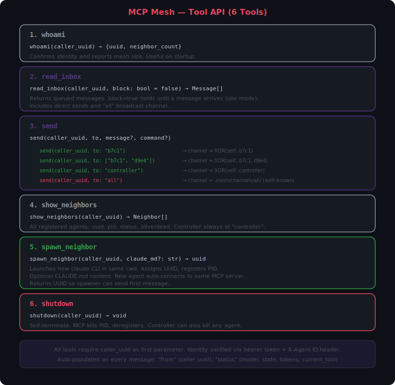
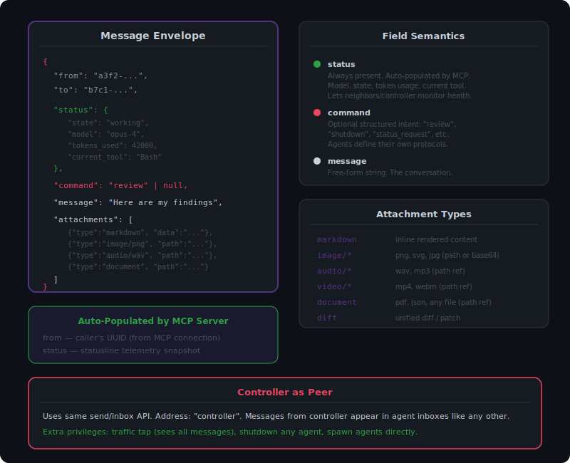
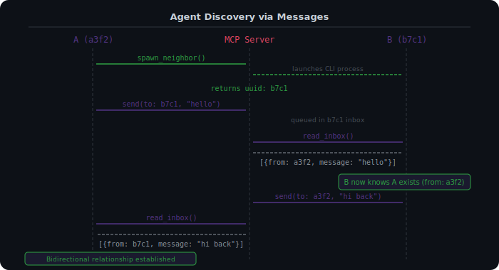

# MCP Mesh — Protocol Design

## Vision

A message-passing actor system where multiple Claude CLI instances communicate as peers through a shared MCP server. Each agent is a node in a mesh network identified by a UUID. Communication is asynchronous via inbox queues. A human controller participates as a privileged peer with the same send/inbox interface, connected through a web UI.

The MCP server is a singleton process that manages message routing, agent lifecycle, and shared filesystem channels. All state is event-sourced: an append-only JSONL log serves as the system of record, with in-memory structures rebuilt from replay on startup.

## Architecture Overview


The mesh consists of three layers: agents (Claude CLI instances or any MCP-capable client), a singleton MCP server, and a controller web UI. Agents connect to the server over streamable-HTTP transport. The controller connects via the same transport with elevated privileges.

For subsystem boundaries and technology decisions, see [ARCHITECTURE.md](ARCHITECTURE.md).

## Tool API (6 Tools)



All tools require `caller_uuid` as the first parameter. The server uses this, combined with bearer token authentication, to verify the caller's identity.

### 1. `whoami(caller_uuid) -> {uuid, neighbor_count}`

Returns the calling agent's UUID and the number of alive neighbors in the mesh. Useful for agents to confirm their identity and assess mesh size on startup.

### 2. `read_inbox(caller_uuid, block?) -> Message[]`

Returns queued messages addressed to the calling agent. Drains the inbox — returned messages are removed.

- `block=false` (default) — returns immediately, possibly empty. Agent continues working.
- `block=true` — holds until at least one message arrives. This is how an agent goes idle and yields execution.

### 3. `send(caller_uuid, to, message?, command?)`

Sends a message to one or more recipients.

| `to` value | Behavior |
|---|---|
| `"<uuid>"` | Direct message to one agent |
| `["<uuid>", "<uuid>"]` | Group message to multiple agents |
| `"00000000-0000-0000-0000-000000000000"` | Broadcast to all alive agents (excluding sender) |
| Controller UUID (`ffffffff-*`) | Message to the human controller |

The `from` field is auto-populated by the server from the authenticated caller identity.

### 4. `show_neighbors(caller_uuid) -> Neighbor[]`

Returns a list of all registered agents: UUID, alive/dead status.

### 5. `spawn_neighbor(caller_uuid, claude_md?, model?, thinking_budget?) -> uuid`

Registers a new agent in the mesh. Generates credentials (UUID, bearer token) and prepares the agent's data directory.

- Optional `claude_md` parameter provides behavioral instructions for Claude agents.
- Optional `model` parameter specifies the Claude model to use (e.g., `"opus-4"`, `"sonnet-4"`).
- Optional `thinking_budget` parameter sets the extended thinking token budget for the spawned agent.
- Returns the new agent's UUID so the spawner can send the first message.

### 6. `shutdown(caller_uuid)`

Agent self-terminates. The server emits an `AgentDeregistered` event and marks the agent as dead. The controller can also shut down any agent.

## Message Schema



Every message has four layers:

```json
{
  "from": "a3f2-...",
  "to": "b7c1-...",

  "status": {
    "state": "working",
    "model": "opus-4",
    "tokens_used": 42000,
    "current_tool": "Bash"
  },

  "command": "review",

  "message": "Here are my findings on the auth module.",

  "attachments": [
    {"type": "markdown", "data": "## Summary\n..."},
    {"type": "image/png", "path": "screenshot.png"},
    {"type": "audio/wav", "path": "recording.wav"},
    {"type": "document", "path": "report.pdf"}
  ]
}
```

### Field Semantics

| Field | Required | Description |
|---|---|---|
| `from` | Always (auto) | Sender's UUID. Auto-populated by the server. |
| `to` | Always (auto) | Recipient UUID(s). |
| `status` | Always (auto) | Statusline-style telemetry: model, state, token usage, current tool. Auto-populated. |
| `command` | Optional | Structured intent: `"review"`, `"status_request"`, `"shutdown"`, etc. Command vocabulary is agent-defined — no standard set is enforced. |
| `message` | Optional | Free-form conversation string. |
| `attachments` | Optional | List of typed objects. Paths are relative to the channel directory. |

### Attachment Types

| Type | Description |
|---|---|
| `markdown` | Inline rendered content (in `data` field) |
| `image/*` | png, svg, jpg — path or base64 |
| `audio/*` | wav, mp3 — path reference |
| `video/*` | mp4, webm — path reference |
| `document` | pdf, json, any file — path reference |
| `diff` | Unified diff / patch |

### Event Model

All state changes are recorded as events in an append-only JSONL log. The server writes each event atomically (write + flush + fsync). On startup, replaying the log reconstructs all in-memory state.

Four event types:

| Event | Fields | Description |
|---|---|---|
| `AgentRegistered` | uuid, token_hash, pid, timestamp | Agent joins the mesh |
| `AgentDeregistered` | uuid, reason, timestamp | Agent leaves (shutdown or killed) |
| `MessageEnqueued` | id, from_uuid, to_uuid, command?, message?, timestamp | Message enters an inbox |
| `MessageDrained` | message_id, by_uuid, timestamp | Message read from inbox |

Incomplete trailing lines in the event log are skipped on replay, providing crash tolerance.

## UUID Scheme

Identity is prefix-based:

| Prefix | Kind | Example |
|---|---|---|
| `00000000-*` | Broadcast | `00000000-0000-0000-0000-000000000000` |
| `ffffffff-*` | Controller | `ffffffff-ffff-ffff-ffff-ffffffffffff` |
| Everything else | Agent | `a3f28b4c-...` |

The function `uuid_kind(uuid)` classifies any UUID by its prefix. This is used throughout the server for routing and access control decisions.

## Addressing

- **Direct**: Full UUID of the target agent.
- **Broadcast**: The nil UUID `00000000-0000-0000-0000-000000000000`. Fans out to all alive agents, excluding the sender.
- **Controller**: Any `ffffffff-` prefixed UUID.
- **BCC not supported**: The `to` field is transparent — all recipients see the full recipient list. This is intentional: recipients need the full list to compute XOR channels for attachments.

## Channel Resolution via XOR


Shared directories for file exchange (attachments, artifacts) are derived deterministically from the participants' UUIDs using XOR.

### The Rule

```
channel_dir = XOR(sorted(participants))
```

### Properties

- **Symmetric**: `A XOR B = B XOR A` — both agents compute the same directory.
- **Associative**: `(A XOR B) XOR C = A XOR (B XOR C)` — generalizes to any group size.
- **Deterministic**: No coordination, negotiation, or lookup needed. Know the members, know the directory.
- **Unique**: UUIDs are universally unique, so no collisions or self-cancellation.
- **Natural access control**: Only members who know the participant UUIDs can derive the channel address.

### Examples

```
Pair:   channel = XOR(a3f2, b7c1)           = 1433
Group:  channel = XOR(a3f2, b7c1, d9e4)     = cc17
```

### Filesystem Layout

```
.mesh/
  agents/
    a3f2-8b4c/
      status.json
    b7c1-2d9f/
      status.json
  channels/
    1433-a6d3/          <- XOR(a3f2, b7c1) pair channel
      attachments/
        screenshot.png
        review.md
    cc17-xxxx/          <- XOR(a3f2, b7c1, d9e4) group channel
      attachments/
    all/                <- well-known broadcast channel
      attachments/
```

### The "all" Channel

`send(to: "all")` uses a well-known directory `.mesh/channels/all/` rather than a computed XOR. This has different semantics from targeted channels:

- It is **persistent** — new agents joining the mesh can read broadcast history.
- It is **public** — any agent can read it without knowing other members' UUIDs.
- It is the place for mesh-wide announcements.

## Agent Discovery



Agents discover each other organically through messages:

1. **Spawner learns UUID** — `spawn_neighbor()` returns the new agent's UUID.
2. **First contact** — spawner sends a message, establishing the relationship.
3. **Reply reveals sender** — the `from` field on received messages teaches agents about each other.
4. **Directory lookup** — `show_neighbors()` lists all registered agents for broadcast or discovery.

No global routing table is needed. The `from` field is the primary discovery mechanism.

## Agent Lifecycle

```
spawn_neighbor(claude_md)
        |
        v
  +- STARTING --+
  |  UUID assigned|
  |  PID registered|
  |  MCP connected|
  +------+-------+
         |
         v
  +-- RUNNING ---+
  |  read_inbox() |<---- receives messages
  |  send()       |----> sends messages
  |  spawn_neighbor()--> creates children
  +------+-------+
         |
         |  read_inbox(block=true)
         v
  +--- IDLE -----+
  |  Blocked on   |
  |  inbox read   |<---- message arrives -> back to RUNNING
  +------+-------+
         |
         |  shutdown() or controller kill
         v
  +-- STOPPED ---+
  |  PID killed   |
  |  Deregistered |
  |  Channel dirs |
  |  preserved    |
  +--------------+
```

## Controller

The controller (human user) participates as a privileged peer.

### Same Interface as Agents

- Has a `ffffffff-` prefixed UUID
- Receives messages via `read_inbox` (rendered in Web UI)
- Sends messages via `send(to: uuid)` into any agent's inbox
- From an agent's perspective, a message from the controller looks like any other message

### Elevated Privileges

| Privilege | Description |
|---|---|
| **Traffic tap** | Can observe all messages between all agents passively. Not visible in message envelopes. |
| **Agent shutdown** | Can terminate any agent by UUID. Agents can only terminate themselves. |
| **Spawn** | Can spawn agents directly (not just through other agents). |

### Controller Interface

The controller connects to the MCP server via streamable-HTTP. The Web UI renders:

- Live message feed (all traffic or filtered by agent)
- Agent status dashboard (UUIDs, PIDs, health, current activity)
- Send interface (select recipient, compose message)
- Spawn interface (launch new agents with optional CLAUDE.md)

### REST API

The controller UI communicates with the mesh server via REST/SSE endpoints mounted on the same Starlette app:

| Method | Path | Description |
|---|---|---|
| GET | /api/events | SSE stream of all events |
| GET | /api/agents | List all agents |
| POST | /api/send | Send message from controller |
| POST | /api/spawn | Spawn agent with optional initial_message |
| POST | /api/agents/{uuid}/shutdown | Deregister agent |
| GET | /api/inbox | Read controller's inbox |
| GET | / | Controller web UI |

## Security

### Bearer Token Authentication

Each agent receives a unique bearer token at spawn time. Requests to the MCP server must include:

- `Authorization: Bearer <token>` — proves identity
- `X-Agent-ID: <uuid>` — declares identity

The server verifies the token against the stored hash before processing any tool call.

### Token Hashing

Tokens are hashed using scrypt with the following parameters:

| Parameter | Value |
|---|---|
| n | 2^14 (16384) |
| r | 8 |
| p | 1 |
| dklen | 32 |

The stored hash format is:

```json
{
  "scheme": "scrypt",
  "salt": "<hex-encoded>",
  "hash": "<hex-encoded>",
  "n": 16384,
  "r": 8,
  "p": 1
}
```

The `scheme` field allows future migration to different hashing algorithms without breaking existing tokens.

### Per-Agent Credentials

Each agent receives its credentials via environment variables:

| Variable | Description |
|---|---|
| `MESH_AGENT_ID` | Agent's public UUID address |
| `MESH_BEARER_TOKEN` | Secret bearer token for authentication |
| `MESH_PRIVATE_KEY` | RSA private key (reserved for future message signing) |
| `MESH_DATA_DIR` | Path to agent's `.mesh/agents/<uuid>/` directory |

## Design Decisions

The original design identified 8 open questions. Here are the resolutions adopted in v0.1:

**Q1 — Message persistence**: Events are persisted to an append-only JSONL log on disk. Inboxes are in-memory structures rebuilt from event replay on startup. This provides durability without the complexity of a database.

**Q2 — Message ordering**: FIFO per-inbox. Events are timestamped. Messages arrive in the order they were enqueued for a given recipient.

**Q3 — Backpressure**: Not implemented in v0.1. Inboxes can grow without bound. This is a future consideration — the expectation is that v0.1 mesh sizes are small enough that this is not a practical concern.

**Q4 — Channel cleanup**: Channel directories are preserved after agent shutdown. This enables post-mortem audit of agent interactions and artifacts.

**Q5 — Authentication**: Bearer tokens per agent, hashed with scrypt. The `X-Agent-ID` header declares identity; the bearer token proves it. Identity is no longer implicit from the connection.

**Q6 — Controller UI transport**: SSE via streamable-HTTP for v0.1. WebSocket is considered for future versions if bidirectional streaming proves necessary.

**Q7 — Group semantics**: The `to` field is transparent — all recipients see the full recipient list. This is required for XOR channel computation: recipients must know all participants to derive the shared directory.

**Q8 — Agent commands**: The command vocabulary is entirely agent-defined. No standard set is enforced by the server. Agents establish their own protocols through the `command` field.

## Future Work

The controller-ui and agent-runtime subsystems are now implemented in v0.2. The remaining planned subsystem:

- **channels** — XOR-derived filesystem channels for attachments and shared artifacts. Manages directory creation, cleanup policies, and access patterns for the `.mesh/channels/` tree.
